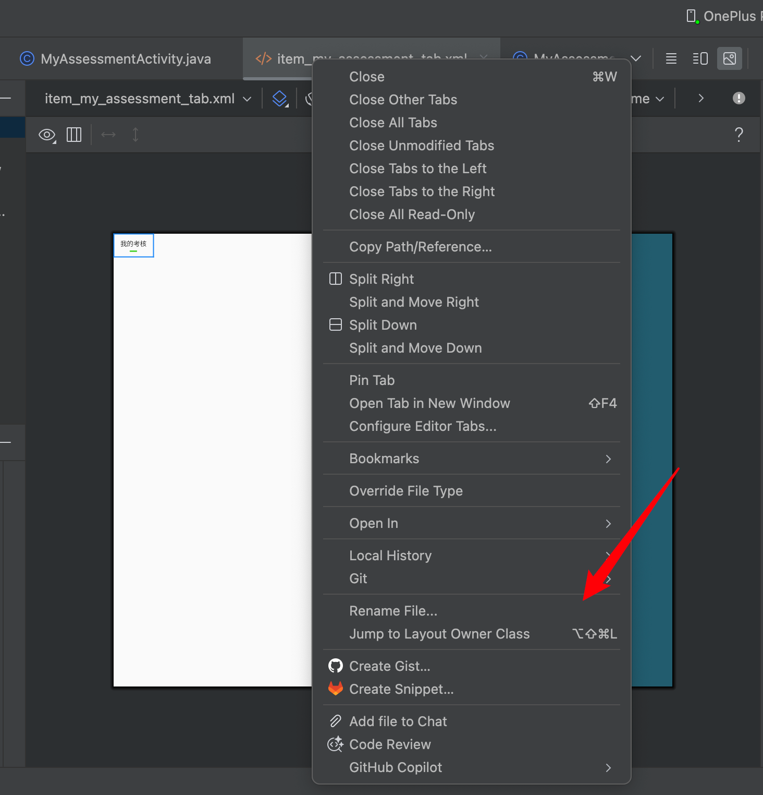

# Android XML Jump

Android XML Jump is an Android Studio plugin that jumps from a layout XML file to the Java or Kotlin class that uses it.

When you are previewing or editing files such as `activity_main.xml`, `item_user.xml`, or `fragment_home.xml`, you no longer need to manually search `R.layout.xxx`, ViewBinding classes, or adapter usages across the project. Right-click the XML editor tab, choose **Jump to Layout Owner Class**, and the plugin opens the most likely owner class directly.



## Features

- Adds **Jump to Layout Owner Class** to the Android Studio editor tab right-click menu.
- Supports the default macOS shortcut: `Command+Ctrl+L`.
- Lets you customize the shortcut from Android Studio Keymap settings.
- Works with layout resources under `res/layout*`, including folders such as `layout`, `layout-land`, and `layout-sw600dp`.
- Finds common layout usage styles:
  - `R.layout.activity_main`
  - `@layout/activity_main`
  - `ActivityMainBinding`
  - DataBinding/ViewBinding generated binding names
- Opens the owner class immediately when there is one clear match.
- Shows a chooser when multiple classes reference the same XML file.

## Usage

### Use the editor tab menu

1. Open an Android layout XML file, for example `res/layout/activity_main.xml`.
2. Right-click the XML file tab at the top of the editor.
3. Click **Jump to Layout Owner Class**.
4. Android Studio opens the Java or Kotlin class that references the layout.

### Use the shortcut

Open or focus a layout XML file, then press:

```text
Command+Ctrl+L
```

The default shortcut can be changed in Android Studio:

```text
Settings/Preferences -> Keymap -> search "Jump to Layout Owner Class"
```

## How It Finds the Owner Class

The plugin combines IntelliJ Platform indexes with Android-specific fallback checks:

1. It first asks IntelliJ's reference index for usages of the current XML resource.
2. If no direct reference is found, it searches indexed project text for common Android layout references.
3. It filters out XML files and opens the surrounding Java/Kotlin class or source file.

This makes it useful for Activity, Fragment, Adapter, custom View, ViewBinding, and DataBinding workflows.

## Installation

### Install from disk

1. Build the plugin zip:

   ```bash
   gradle buildPlugin
   ```

2. Open Android Studio.
3. Go to:

   ```text
   Settings/Preferences -> Plugins
   ```

4. Click the gear icon and choose **Install Plugin from Disk...**.
5. Select:

   ```text
   build/distributions/android-xml-jump-0.1.0.zip
   ```

6. Restart Android Studio.

### Install from JetBrains Marketplace

After the plugin is published and approved on JetBrains Marketplace, it can be installed directly from Android Studio:

```text
Settings/Preferences -> Plugins -> Marketplace -> search "Android XML Jump"
```

## Development

### Requirements

- macOS, Windows, or Linux
- JDK 21
- Gradle 9.6.1 or the included Gradle Wrapper
- Android Studio 2024.2+ target platform

### Build

```bash
gradle buildPlugin
```

The generated plugin zip is written to:

```text
build/distributions/
```

### Run in a sandbox Android Studio

```bash
gradle runIde
```

### Publish to JetBrains Marketplace

To make the plugin searchable inside Android Studio, it must be uploaded to JetBrains Marketplace and pass JetBrains review.

For the first release, JetBrains Marketplace requires a manual upload from the Marketplace web UI so you can create the plugin listing and set required metadata such as license, repository URL, vendor information, and plugin category.

1. Build the plugin zip:

   ```bash
   gradle buildPlugin
   ```

2. Open JetBrains Marketplace in your browser.
3. Create a new plugin listing.
4. Upload:

   ```text
   build/distributions/android-xml-jump-0.1.0.zip
   ```

5. Set the repository URL:

   ```text
   https://github.com/itgoyo/android-xml-jump
   ```

6. Submit the plugin for JetBrains review.

After the first Marketplace upload exists, later versions can be published from Gradle with a Marketplace token:

1. Export the token locally:

   ```bash
   export PUBLISH_TOKEN="YOUR_MARKETPLACE_TOKEN"
   ```

2. Publish the plugin:

   ```bash
   gradle publishPlugin
   ```

The Gradle build reads the token from the `PUBLISH_TOKEN` environment variable. Do not commit the token to GitHub.

## Project Structure

```text
src/main/kotlin/com/itgoyo/androidxmljump/GoToLayoutOwnerAction.kt
src/main/resources/META-INF/plugin.xml
docs/images/editor-tab-menu.png
build.gradle.kts
```

## Keywords

Android Studio plugin, Android layout XML, jump to Activity, jump to Fragment, ViewBinding, DataBinding, IntelliJ Platform plugin.
